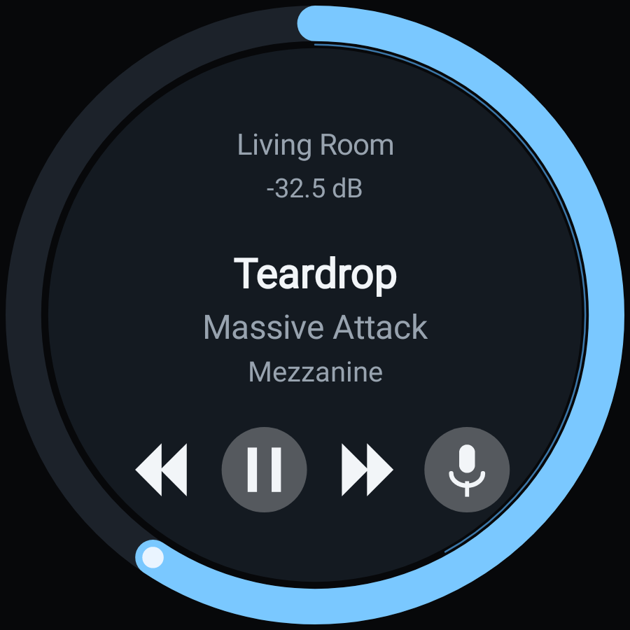
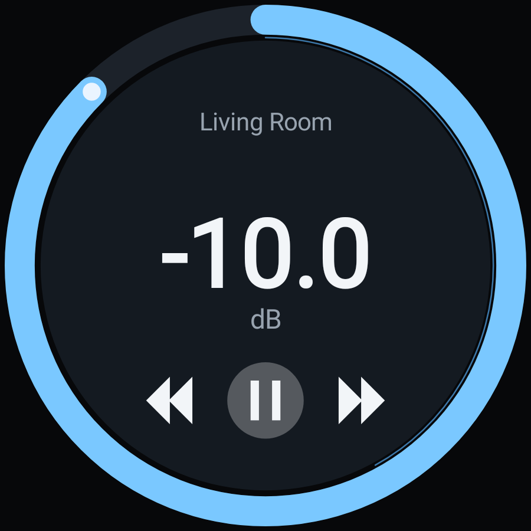
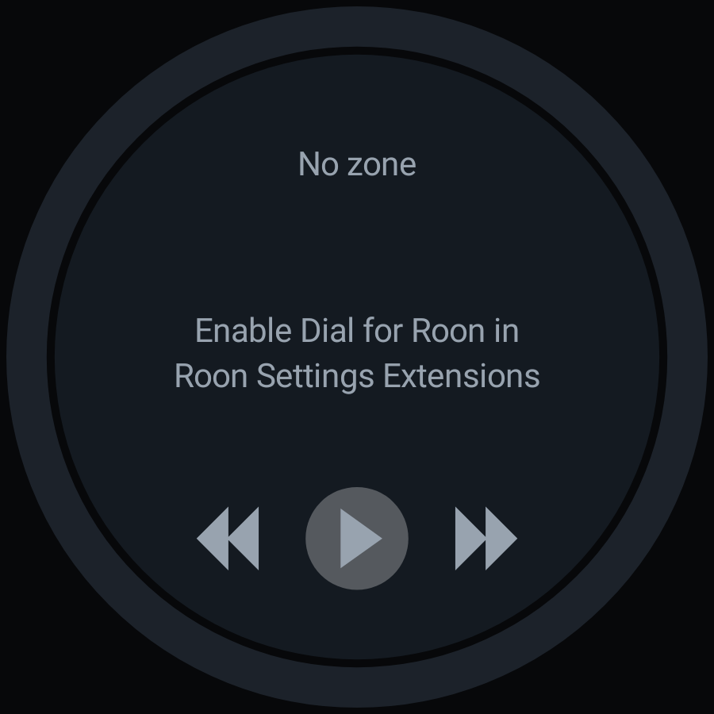
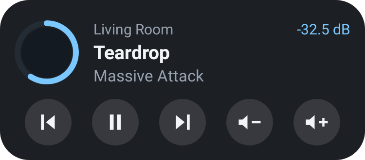
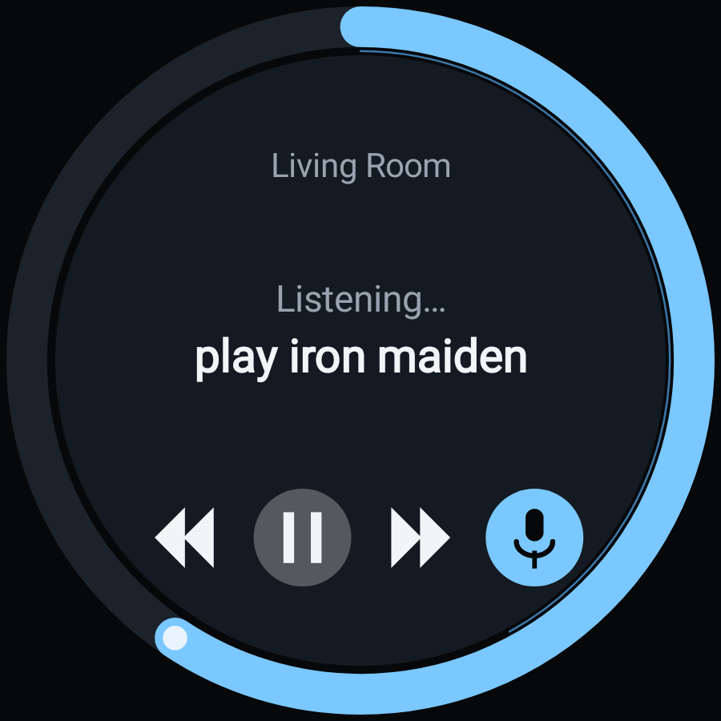

# Dial for Roon (Android)

An Android app that registers itself as a **Roon extension** and presents a
round dial: a volume ring you sweep with your thumb, album art in the middle,
transport underneath. It talks to the Roon Core directly — no bridge, no
Docker, no Node host, no companion service.

| Now playing | Adjusting volume | Waiting for approval |
|---|---|---|
|  |  |  |



*(All rendered from the real view code — see "Verification" below.)*

## Install

### [⬇ Download the APK](https://github.com/meltface-80/Display-extension-apk/raw/main/dist/dial-for-roon-0.9.0.apk)

Android 8.0 (API 26) or newer. Sideload it, then once:

1. Open the app on the same Wi-Fi as your Roon Core.
2. In Roon: **Settings → Extensions → Enable "Dial for Roon"**.

The pairing token is stored per Core, so approval only happens the first time.

That link is the `/raw/` one deliberately. The file's ordinary page on GitHub
(a `/blob/` URL) serves a 225 KB web page rather than the 3.6 MB app, so it
looks like a broken download to anyone who doesn't know to hunt for the
*Download raw file* button.

### If Android gets in the way

- **"This type of file can harm your device."** Chrome says that about every
  APK, not this one in particular. Choose to keep the file.
- **Nothing happens when you open it.** The installer needs *Install unknown
  apps* permission for whichever app you downloaded with — usually Chrome or
  your file manager.
- **Play Protect says the app wasn't scanned, or looks unsafe.** It is signed
  with the standard Android debug key, which is what any unpublished build
  gets. That is what Play Protect is reacting to; install anyway if you're
  happy to.
- **"App not installed."** An older copy signed with a different key is
  probably still on the device. Uninstall that first — signatures have to
  match to upgrade in place.

## Use

| Gesture | Action |
|---|---|
| Sweep the outer ring | Volume, quantised to the output's own step, one haptic tick per step |
| Tap the zone name | Zone picker |
| Tap the volume readout | Mute / unmute |
| Tap ⏮ ⏯ ⏭ | Previous / play-pause / next |
| Long-press the middle | Menu: zone, reconnect, re-discover, manual Core address |

A full sweep of the ring covers the output's whole range in about 320° of
rotation, whether that range is in dB or arbitrary units.

## Widget

The same dial, on the home screen. It is not a lookalike: the widget renders
the app's own `DialView`, so a change to the dial changes both.

A widget is `RemoteViews`, which allows no custom views and no gestures, so the
dial arrives as an image with tap targets over it:

| Tap | Action |
|---|---|
| The − and + buttons on the ring | Volume down / up |
| The three controls at the bottom | Previous, play/pause, next |
| Anywhere else | Opens the app |

The ring cannot be swept here. A drag on the home screen belongs to the
launcher — reaching for a rotary gesture gets you the notification shade — so
volume is two buttons, drawn the size of the transport controls because that is
what they are: the only way to change volume from the widget, not a hint about
one.

The targets are weighted thirds rather than measured positions, because a
widget only ever approximately knows its own size — thirds land on the drawn
controls at any size and give a finger something generous to hit.

The second-by-second progress arc is dropped too: redrawing and re-sending the
whole image every second is not what a widget is for.

One press of volume moves about a sixty-fourth of the output's range, which
lands near 1 dB on a typical DAC; a single step is right for the volume rocker
but means 160 presses end to end on a 0.5 dB output.

The press you make with the app long dead is the interesting case. It starts
the process, and a second or two passes before the extension has registered and
knows what the zones are, so the press is queued as an intent — "volume up",
not a number of steps — and runs once there is a zone to run it against.
Anything older than 20 seconds is dropped, because a press that fires after
you've given up is worse than one that never fired. Until then the widget shows
the last dial it drew, kept on disk for exactly that.

## Ask for music

Tap the microphone, say "play Iron Maiden", and it plays.



This deliberately owes nothing to Google Assistant or Gemini. The app runs
Android's own speech recogniser, cleans up the phrase — people say "play Iron
Maiden", and searching Roon for the word "play" only makes the results worse —
and sends the rest to Roon's browse service as a search. Nothing depends on
which assistant is installed, on winning the media button session, or on
anything Google is retiring.

Roon's browse API is a hierarchy walk rather than a query language: a search
returns categories, a category returns matches, and a match returns a list of
actions, one of which starts playback. Rather than hard-coding the shape of
that tree — which differs between an artist, an album and a track — the app
opens the first real result at each level until it reaches a list of actions,
then picks the one that plays. It prefers "Play Now", and refuses to guess when
an action list offers nothing that plays, rather than queueing or deleting
something by accident.

It plays into whichever zone is selected. The widget's microphone opens the app
already listening, since a widget cannot record audio itself.

## Voice control (the assistant route)

Gemini is a `MediaController`. It doesn't know anything about this app — it
finds the system's active media session and issues standard Player commands
over it. So the app publishes one, backed by a media3 player that forwards
those commands to the Roon zone.

| Say | What happens |
|---|---|
| "Hey Google, pause" / "resume" | `transport:2/control` play or pause on the selected zone |
| "Hey Google, next" / "previous" | Skips, but only when Roon reports the skip as allowed |
| Volume rocker, or the system volume slider | One press is exactly one step of the zone's own volume scale |
| "Hey Google, volume up" | Untested — Gemini documents volume control as adjusting *the device's* volume, and whether it follows a remote session isn't documented |

The same session drives the notification, the lock screen, headset and car
buttons, and Wear.

A zone with nothing playing still reports itself as a live, controllable
session rather than as idle. media3 reads idle as nothing to show — it takes
the notification away and stops counting the session as engaged — so an
assistant asked to play would find an empty timeline and no play command. A
zone Roon has stopped rather than paused lands in exactly that state, which is
precisely when "play" needs to work.

Two facts worth knowing, both established by reading media3's source rather
than by guessing. Media-session notifications are exempt from the
POST_NOTIFICATIONS permission, so denying notifications is never the reason
voice control fails. And the media service stays in the foreground for at most
ten minutes after playback pauses — that ceiling is fixed and cannot be raised
— after which the session survives only as long as the process does.

If a command is recognised but nothing happens, the app's long-press menu has
**Voice control status**, which reports each link in the chain separately: the
session, the zone, the commands it offers, the notification, and audio focus.
Voice control fails silently by nature — the assistant hears the words, finds
no session it wants, and says nothing useful — so the point is to place the
failure rather than guess at it.

### Why spoken transport is hard here, exactly

Android awards the *media button session* — the one an assistant drives — in
`MediaSessionStack.updateMediaButtonSessionIfNeeded`, which walks a single
list: the UIDs that have recently **rendered audio**, most recent first. An app
that has never played a sample is never a candidate, however correct its media
session is. Audio focus is not consulted anywhere in that path; the word does
not appear in the file.

This app plays nothing — the music is on the hi-fi — so it is categorically
excluded. The menu's **Claim media control** makes it eligible the only way
available: while the zone plays it renders a looping buffer of silence, which
registers this UID as having played audio. It is off by default because the
cost is real — a little battery, and while it runs this app takes the media
button session from an app genuinely playing on the phone.

Remote volume is different and works without any of that: the volume-key path
checks only that the session is playing and can handle volume keys, with no
local-audio requirement.

Two caveats worth knowing:

- **The session must be the active one.** If Spotify is playing on the phone,
  a bare "pause" goes to Spotify. This is how Android arbitrates, not something
  an app can override.
- **Nothing plays on the phone**, so this is a remote session in the same shape
  as a Cast one. The service goes foreground when the zone is playing, which is
  what keeps voice control alive with the app off screen. If the app has been
  backgrounded with nothing playing and playback then starts from elsewhere,
  Android may refuse the foreground start and the notification won't appear
  until the app is reopened.

"Play *this specific album*" is a separate problem — it needs
`onPlayFromSearch` plus Roon's browse service to resolve a title to an album —
and it isn't built. Gemini's documented device-assistance commands cover
transport and volume, not playing named content in third-party apps.

## How it works

Two protocols, both spoken natively in Kotlin:

- **SOOD** (`roon/Sood.kt`) — Roon's UDP discovery. A query goes to
  `239.255.90.90:9003` and to the subnet broadcast address; Cores answer with
  their `unique_id` and the port their extension API listens on. Android
  filters multicast out of userspace, so the app holds a `MulticastLock`.
- **MOO over WebSocket** (`roon/Moo.kt`) — `ws://<core>:<port>/api` carrying
  HTTP-shaped text frames. Registration is
  `com.roonlabs.registry:1/info` → `register` → (user enables the extension)
  → `Registered` + token, after which
  `com.roonlabs.transport:2/subscribe_zones` streams zone state and
  `change_volume` / `control` drive it.

Album art comes from the image service's plain-HTTP form:
`http://<core>:<port>/api/image/<key>?scale=fit&width=720&height=720&format=image/jpeg`.

### Things the protocol makes you get right

- **Volume is per output, not per zone.** A grouped zone has one output per
  device, each with its own type, range and step; the ring drives all of them.
- **`type: "incremental"`** controls report no value, range or step at all —
  only relative ±1 is legal, so the ring switches to detents with no arc.
- **Fixed-volume outputs** have no `volume` object; the ring goes inert.
- **`soft_limit`** caps the top of the ring where a device sets one.
- Rotation is quantised to whole steps with the remainder carried over, and
  sends are coalesced to ~16/s with an optimistic local value that yields to
  the Core's echo after 900 ms.

### Media session layer

`media/RoonPlayer.kt` is a media3 `SimpleBasePlayer` presenting the zone:

- Roon owns the queue, so the playlist is synthetic — a placeholder either
  side of the current track, present only when Roon reports that skip as
  allowed. A single-item playlist would make the player report that it cannot
  skip at all, and the buttons would disappear.
- "Previous" always means Roon's previous. The default player restarts the
  current track once you're a few seconds in; Roon has its own rule for that,
  so the threshold is pushed out of the way.
- Volume is declared `PLAYBACK_TYPE_REMOTE` with the zone's step count as its
  scale (a −80…0 dB output in 0.5 dB steps becomes a 0–160 scale). A
  fixed-volume zone reports no remote control at all, so the keys keep
  adjusting the phone instead of vanishing into a control that isn't there.

## Build

```
ANDROID_HOME=/path/to/sdk ./gradlew :app:assembleRelease
```

Needs JDK 17+, Android SDK platform 36 and build-tools 36.0.0. Output lands in
`app/build/outputs/apk/release/`.

## Verification

`./gradlew :app:testReleaseUnitTest` — 65 tests:

- **Wire format.** Frames produced by the Kotlin encoder are parsed back by
  `node-roon-api`'s own `moo.js`, and the SOOD query by the parser lifted from
  `sood.js`, so the framing is checked against Roon's reference implementation
  rather than against my reading of it.
- **Zone state.** `subscribe_zones` payloads: the initial set, added / removed
  / changed deltas, and the separate seek-position delta that must not clobber
  anything else.
- **The ring.** Robolectric renders the real view with native Skia and dispatches
  real `MotionEvent`s: a 90° clockwise sweep on a −80…0 dB output with a 0.5 dB
  step produces exactly +45 steps, a 60° counter-clockwise sweep −30, a sweep
  across the 12 o'clock seam doesn't spike, and a fixed-volume zone produces
  none. The preview images above are that renderer's output.
- **Voice control.** A real `MediaController` — which is what Gemini is —
  connects to the published session and drives it: pause, next, previous,
  volume up/down and mute all arrive at the Roon client as the right commands,
  and the session advertises exactly the commands the zone allows.
- **The widget.** The dial is rendered and decoded back: it comes out at the
  right size, its corners stay transparent so the widget keeps its rounded
  edges, every control has a tap target, and the image travels as compressed
  data well under the 1 MB Binder buffer a `RemoteViews` bitmap would otherwise
  have to cross whole. Plus: a seek update does not count as a change worth
  redrawing, and a queued press expires rather than firing late.

**Not yet verified against a live Roon Core** — there is no Core in the build
environment. The protocol layer is checked against Roon's own code and the UI
against a real renderer, but the first end-to-end pairing is untested.

## Limits

- LAN only. Extensions have no remote/ARC path; away from home needs a VPN.
- The phone cannot become a Roon *output* — that needs RAAT, which is licensed
  only through the Roon Ready partner programme. This is a control surface.
- Requires a running Roon Server and a Roon subscription.

## Licence

MIT, see [LICENSE](LICENSE). Not affiliated with or endorsed by Roon Labs.
"Roon" is their trademark.
